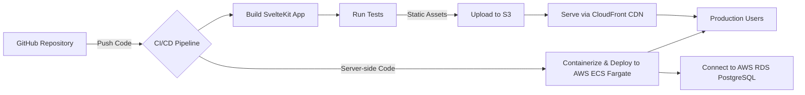

## 8. Deployment Strategy

A robust CI/CD pipeline will ensure efficient and reliable deployment of
SocialCraft to AWS.

The deployment pipeline will follow these steps:

1. **GitHub Repository:** All source code will be managed in a GitHub
   repository.
2. **CI/CD Trigger:** A push to the `main` branch (or a pull request merge) will
   trigger the CI/CD pipeline (e.g., using GitHub Actions).
3. **Build SvelteKit App:** The pipeline will build the SvelteKit application,
   generating static assets (HTML, CSS, JS) and server-side bundles.
4. **Run Tests:** Automated unit, integration, and end-to-end tests will run to
   ensure code quality and prevent regressions.
5. **Frontend Deployment (Static Assets):**
   - The built static assets will be uploaded to an AWS S3 bucket configured for
     static website hosting.
   - AWS CloudFront will be used as a Content Delivery Network (CDN) in front of
     the S3 bucket to cache content globally, reducing latency and improving
     load times for users worldwide.
6. **Backend Deployment (Server-side Logic):**
   - The server-side SvelteKit application (which handles `+page.server.ts` and
     API routes) will be containerized (e.g., Docker).
   - This container will be deployed to AWS Elastic Container Service (ECS)
     using AWS Fargate as the compute engine. Fargate provides a serverless
     compute experience for containers, eliminating the need to manage
     underlying EC2 instances. This ensures scalability and operational
     simplicity.
   - The ECS service will be configured to connect to the AWS RDS PostgreSQL
     database.
7. **Database (AWS RDS):** The PostgreSQL database will reside in Amazon RDS,
   providing a managed relational database service that handles patching,
   backups, and scaling.
8. **Monitoring and Rollback:** The pipeline will include steps for monitoring
   post-deployment health checks. In case of issues, automated rollback to a
   previous stable version will be configured.