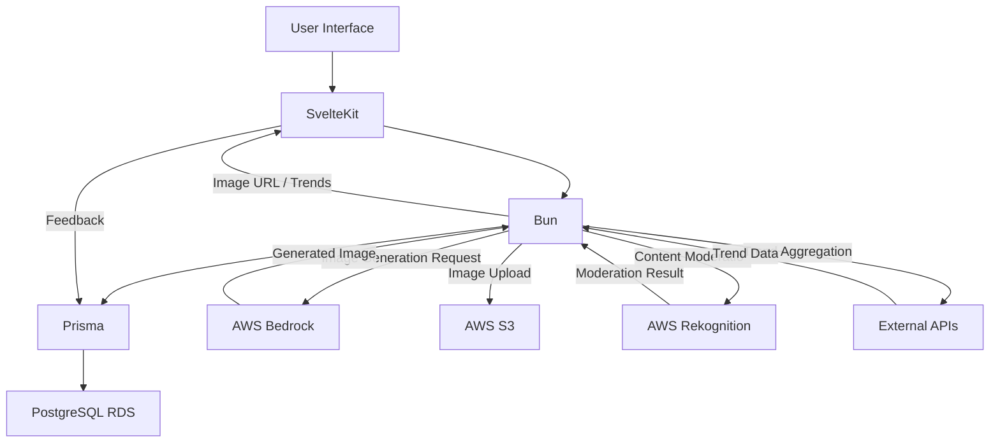
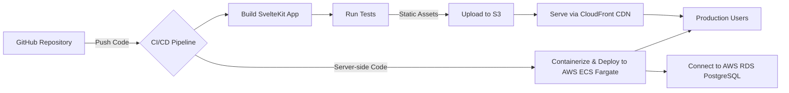

# SocialCraft: AI-Powered Visual Content Platform - Production-Ready Development Blueprint

## 1. Project Vision & Core Identity

The development of **SocialCraft** is envisioned as an AI-powered web application
designed to empower small businesses and content creators by generating
trend-aware images. This platform will leverage real-time social media insights
to produce stunning visuals, ensuring brand relevance and engagement. The core
objective is to deliver a modern, user-friendly experience underpinned by robust
backend integrations and a scalable cloud infrastructure.

### Project Metadata

To ensure optimal discoverability and consistent branding across various digital
touchpoints, the following metadata has been defined for SocialCraft. This
information is crucial for search engine optimization (SEO), social media
sharing, and providing a clear identity for the application.

| Key            | Value                                                                                                                                                    | Description                                                                                                                                         |
| :------------- | :------------------------------------------------------------------------------------------------------------------------------------------------------- | :-------------------------------------------------------------------------------------------------------------------------------------------------- |
| `name`         | "SocialCraft"                                                                                                                                             | The official name of the application, chosen for its concise and descriptive nature, implying the creation or "forging" of trends.                  |
| `description`  | "An AI-powered web application that generates trend-aware images for small businesses and content creators, leveraging real-time social media insights." | A brief, compelling summary highlighting the application's core functionality and target audience.                                                  |
| `keywords`     | "AI, Image Generation, Content Creation, Social Media, Trends, Visuals, Small Business, Marketing, Creative Tools"                                       | A comprehensive list of terms to aid search engine indexing and categorize the application within relevant technology and market segments.          |
| `author`       | "Your Development Team"                                                                                                                                  | Identifies the creators of the application.                                                                                                         |
| `og:image`     | "/images/og-image.png"                                                                                                                                   | The URL to an image that will be displayed when the application is shared on social media platforms, enhancing visual appeal and brand recognition. |
| `twitter:card` | "summary_large_image"                                                                                                                                    | Specifies the type of Twitter card to use, ensuring a rich media preview when links to SocialCraft are shared on Twitter.                            |

### Key Features Overview

SocialCraft will provide a streamlined workflow for visual content creation,
focusing on three primary capabilities:

- **AI-powered image generation:** Create high-quality images from text prompts.
- **Real-time trend aggregation:** Leverage current social media insights to
  inform content.
- **Intelligent style suggestions:** Guide users towards trend-driven visual
  aesthetics.

The platform will also incorporate essential features such as content moderation
and a feedback loop to continuously refine the AI model's output and style
suggestions.

### Architectural Philosophy

The architectural design of SocialCraft is founded on principles of
**modularity**, **scalability**, **performance**, and **security-by-design**.

- **Modularity** ensures that components are loosely coupled, facilitating
  independent development, testing, and maintenance.
- **Scalability** is addressed through the strategic use of AWS cloud services,
  allowing the application to handle increasing user loads and data volumes
  seamlessly.
- **Performance** is prioritized by leveraging modern, efficient technologies
  and offloading heavy computations to the server side.
- **Security** is woven into every layer of the application, from server-side
  logic to content moderation, safeguarding user data and platform integrity.

The deliberate selection of a modern, performant stack, including **SvelteKit
5** and **Bun**, combined with **server-side rendering** via `+page.server.ts`
and AWS serverless components like **Bedrock**, **S3**, and **Rekognition**,
underscores a strong commitment to minimizing client-side load and maximizing
responsiveness. This is particularly crucial for a generative AI application,
where heavy computations are often involved, indicating a foundational
architectural decision centered on performance.

## 2. Core Technology Stack & Setup

The foundation of SocialCraft is built upon a robust and modern technology stack,
carefully chosen for its performance, developer experience, and scalability.
This section details the core components and their integration.

### Architectural Diagram

The following Mermaid diagram illustrates the high-level interaction between the
various components of the SocialCraft application, from the frontend user
interface to the backend services and cloud infrastructure.



### Frontend Stack

The frontend of SocialCraft is engineered for a fast, responsive, and intuitive
user experience, leveraging the latest advancements in SvelteKit and its
ecosystem.

#### SvelteKit & Svelte 5 Runes

SocialCraft will be developed using **SvelteKit**, with a strong emphasis on
**Svelte 5's new Runes API** for managing reactivity. This approach ensures
explicit and predictable state management, leading to cleaner and more
maintainable code. All Svelte component `script` tags will utilize `lang='ts'`
to enforce TypeScript, enhancing code quality and developer productivity.

Svelte 5 introduces a new reactivity model centered around "runes," which are
compiler instructions designed to make reactivity more explicit. Unlike Svelte
4's implicit reactivity for top-level `let` declarations, Svelte 5 requires
`let count = $state(0);` for reactive state variables. This shift from implicit
to explicit reactivity represents a significant architectural choice, reducing
"magic" in the codebase and making the flow of data more transparent. This
clarity is particularly beneficial for complex applications and large teams, as
it improves predictability and debugging. While this change might introduce a
learning curve for developers accustomed to Svelte 4, the long-term benefits in
terms of code maintainability and TypeScript integration are substantial.

Derived state, previously handled by `$:`, will now use `$derived`. For example,
`let doubled = $derived(count * 2);` ensures that `doubled` automatically
updates whenever `count` changes. Side effects, which were also managed by `$:`,
will now be explicitly declared using `$effect(() => { /*... */ });`. This
separation of concerns for derivations and effects leads to more focused and
understandable reactive blocks. Component properties will be declared using the
`$props` rune, allowing for destructuring and default values, such as
`let { greeting = 'Hello!' } = $props();`. This modernizes prop handling and
aligns with contemporary JavaScript patterns. Furthermore, event dispatchers are
deprecated in Svelte 5, with a move towards more direct event attributes for DOM
elements (e.g., `onclick` instead of `on:click`) and snippets for slot content.

#### Tailwind CSS v4 Integration

**Tailwind CSS** will be integrated for utility-first styling, providing a
highly customizable and efficient styling workflow. The project will leverage
Tailwind CSS v4, utilizing the `@tailwindcss/vite` plugin for seamless
integration with SvelteKit's Vite build process. The `tailwind.config.js` file
will be customized to define the application's design system, including the
color palette and typography.

The integration involves adding `@tailwindcss/vite` to `vite.config.ts`. A
central `src/app.css` file will import Tailwind CSS using
`@import "tailwindcss";`, which will then be imported into the root
`+layout.svelte`. For component-specific styles within `<style>` blocks,
`@reference "tailwindcss";` will be used to ensure Tailwind processes those
styles, and custom theme properties defined via `@theme` in `app.css` can be
directly accessed as CSS variables.

Tailwind CSS v4's design choice to rely on modern CSS features like `@property`
and `color-mix()` means it targets modern browsers (Safari 16.4+, Chrome 111+,
Firefox 128+). This is a forward-looking decision that prioritizes access to
cutting-edge styling capabilities and potentially improved performance,
accepting a trade-off by not supporting older browser versions. This strategic
alignment with modern web standards ensures the application can leverage the
latest design possibilities.

#### Shadcn-Svelte UI Components

**Shadcn-Svelte** will be incorporated for pre-built, customizable UI
components, providing a solid foundation for the user interface while allowing
for extensive theming and adaptation. The installation process will involve
`bunx shadcn-svelte@latest init` to configure aliases (e.g.,
`$lib/components/ui`) and then installing individual components as needed (e.g.,
`bunx shadcn-svelte@latest add button`). The project will also consider
`shadcn-svelte-extras` via `jsrepo` for additional components, enabling a
broader range of UI elements.

The philosophy behind Shadcn-Svelte emphasizes "building your own" components
rather than simply copy-pasting pre-configured examples. This approach, combined
with the use of `jsrepo` for managing component additions, signifies a strong
commitment to component ownership and deep customizability. Developers are
encouraged to understand and adapt the underlying components to fit the specific
design system and requirements of SocialCraft, rather than relying on a fixed,
opinionated library. This provides unparalleled flexibility and ensures a unique
visual identity, but it also implies a greater responsibility for component
maintenance and a deeper understanding of their composition.

### Backend & Runtime

The backend infrastructure is designed for high performance, efficient data
management, and seamless integration with AWS services.

#### Bun Runtime

**Bun** will serve as the primary JavaScript runtime for development, package
management, and server-side execution. Bun is chosen for its exceptional speed,
native TypeScript support, and its all-in-one toolkit approach, which includes a
bundler, test runner, and Node.js-compatible package manager. Its ability to
directly execute `.ts` and `.tsx` files and respect `tsconfig.json` settings
streamlines the development workflow.

While Bun offers compelling performance benefits and a cohesive developer
experience, community discussions highlight potential maturity issues and edge
cases for production deployments. For instance, some users have reported
difficulties with Bun builds on certain Linux environments and suggest using the
regular Node.js adapter for SvelteKit to avoid bugs. This observation points to
a strategic trade-off between adopting bleeding-edge performance and ensuring
production stability. For SocialCraft, this means while Bun will be heavily
utilized in development for its speed (e.g., `bun --bun run dev` to explicitly
use Bun's runtime for development scripts), the deployment strategy will
carefully consider the stability of the SvelteKit adapter for Bun versus the
more mature Node.js adapter, potentially opting for the latter until Bun's
production readiness fully matures.

#### Prisma ORM with PostgreSQL on Amazon RDS

**Prisma** will be used as the Object-Relational Mapper (ORM) for database
management, connected to a **PostgreSQL** instance hosted on **Amazon RDS**.
This combination provides a robust, scalable, and type-safe database solution.

The setup involves installing `@prisma/client` and `prisma` development
dependencies, followed by `bunx prisma init` to generate the `prisma` directory
and `schema.prisma` file. Database models for images, trends, and feedback will
be defined in `schema.prisma`, and `bunx prisma migrate dev` will be used for
schema migrations. The `DATABASE_URL` will be securely stored in the `.env` file
and accessed via `$env/static/private` in SvelteKit's server-side code.

A critical consideration for database performance and scalability, especially in
a serverless or highly concurrent environment, is connection management. The
recommendation to use a connection pooler like **Prisma Accelerate** is
paramount. Without a pooler, frequent instantiation of `PrismaClient` per
request could exhaust database connections, leading to application instability
and performance degradation. Therefore, `src/lib/prisma.ts` will instantiate
`PrismaClient` with `.$extends(withAccelerate())` to ensure efficient connection
pooling. This proactive approach to managing database resources is fundamental
to the "production-ready" goal.

### Cloud Services (AWS)

SocialCraft will heavily rely on **Amazon Web Services (AWS)** for its core AI,
storage, and moderation functionalities, leveraging the AWS SDK for JavaScript
v3 for seamless integration.

- **Amazon Bedrock:** Used for text-to-image generation. The
  `@aws-sdk/client-bedrock` package will be utilized to invoke foundation models
  like Stable Diffusion XL.
- **Amazon S3:** Employed for scalable and durable storage of generated images.
  The `@aws-sdk/client-s3` package will handle image uploads and retrieval.
- **Amazon Rekognition:** Integrated for automated content moderation of
  generated images, ensuring compliance and platform safety. The
  `@aws-sdk/client-rekognition` package will be used for detecting inappropriate
  content.

AWS SDK for JavaScript v3 will be configured with credentials and region
settings via environment variables (`.env`). All AWS interactions will leverage
`async/await` patterns for clean and efficient asynchronous operations, as
demonstrated in AWS SDK examples.

### Initial Project Setup & Configuration Steps

A systematic approach to project setup is crucial for consistency and
efficiency.

1. **Initialize SvelteKit with Bun:**
   ```bash
   bun create svelte@latest SocialCraft
   cd SocialCraft
   bun install
   ```
   This command initiates a new SvelteKit project and installs dependencies
   using Bun, leveraging its speed for initial setup.

2. **Integrate Tailwind CSS v4:**
   ```bash
   bunx sv add tailwindcss
   ```
   Update `tailwind.config.js` to define the custom color palette and
   typography, and configure `vite.config.ts` to include the `@tailwindcss/vite`
   plugin.
   ```javascript
   // tailwind.config.js
   const defaultTheme = require("tailwindcss/defaultTheme");
   module.exports = {
     content: ["./src/**/*.{html,js,ts,svelte}"],
     theme: {
       extend: {
         colors: {
           primary: "#4F46E5", // Indigo-600
           "primary-dark": "#4338CA", // Indigo-700 for hover
           secondary: "#10B981", // Emerald-500
           accent: "#F59E0B", // Amber-500
           background: "#F9FAFB", // Light Gray
           text: "#1F2937", // Dark Gray
           "text-light": "#4B5563", // Medium Gray
           "border-light": "#E5E7EB", // Light Border
         },
         fontFamily: {
           display: ["Space Grotesk", ...defaultTheme.fontFamily.sans],
           body: ["Inter", ...defaultTheme.fontFamily.sans],
         },
       },
     },
     plugins: [], // Add any necessary plugins here
   };
   ```
   Ensure `src/app.css` contains `@import "tailwindcss";` and
   `src/routes/+layout.svelte` imports `../app.css`.

3. **Install Shadcn-Svelte:**
   ```bash
   bunx shadcn-svelte@latest init
   bunx shadcn-svelte@latest add button input select card dialog progress toast textarea
   ```
   Configure aliases in `components.json` and install required components.

4. **Set Up AWS SDK:**
   ```bash
   bun add @aws-sdk/client-bedrock @aws-sdk/client-s3 @aws-sdk/client-rekognition
   ```
   Create a `.env` file for AWS credentials and S3 bucket name.
   ```dotenv
   AWS_ACCESS_KEY_ID=your_access_key
   AWS_SECRET_ACCESS_KEY=your_secret_key
   AWS_REGION=us-east-1
   S3_BUCKET_NAME=SocialCraft-images
   ```

5. **Configure Prisma with Amazon RDS:**
   ```bash
   bun add @prisma/client
   bunx prisma init
   ```
   Update `prisma/schema.prisma` with the necessary models (`Image`, `Trend`,
   `Feedback`) and run migrations.
   ```prisma
   // prisma/schema.prisma
   generator client {
     provider = "prisma-client-js"
     output   = "../src/lib/generated/prisma/client"
   }

   datasource db {
     provider = "postgresql"
     url      = env("DATABASE_URL")
   }

   model Image {
     id        Int      @id @default(autoincrement())
     prompt    String
     style     String?
     imageUrl  String
     isPublic  Boolean  @default(false)
     createdAt DateTime @default(now())
     feedback  Feedback[] // An image can have multiple feedback entries
   }

   model Trend {
     id        Int      @id @default(autoincrement())
     name      String   @unique
     updatedAt DateTime @default(now())
   }

   model Feedback {
     id        Int      @id @default(autoincrement())
     imageId   Int
     rating    Int      @min(1) @max(5)
     comment   String?
     createdAt DateTime @default(now())
     image     Image    @relation(fields: [imageId], references: [id])
   }
   ```
   Run `bunx prisma migrate dev --name init` to apply the schema and generate
   Prisma Client. Create `src/lib/prisma.ts` for Prisma Client instantiation
   with Accelerate for connection pooling:
   ```typescript
   // src/lib/prisma.ts
   import { PrismaClient } from "./generated/prisma/client";
   import { DATABASE_URL } from "$env/static/private";
   import { withAccelerate } from "@prisma/extension-accelerate";

   const prisma = new PrismaClient({
     datasourceUrl: DATABASE_URL,
   }).$extends(withAccelerate());

   export default prisma;
   ```

### Core Dependencies & Versions

Maintaining a clear record of core dependencies and their versions is essential
for project stability and reproducibility.

| Dependency                     | Category         | Version           | Purpose                                                          |
| :----------------------------- | :--------------- | :---------------- | :--------------------------------------------------------------- |
| SvelteKit                      | Framework        | `^2.x.x` (latest) | Full-stack web framework for Svelte applications.                |
| Svelte                         | UI Library       | `^5.0.0-next.x`   | Reactive UI library with Runes for explicit reactivity.          |
| Bun                            | Runtime          | `^1.x.x` (latest) | Fast JavaScript runtime, package manager, bundler, test runner.  |
| Tailwind CSS                   | Styling          | `^4.x.x` (latest) | Utility-first CSS framework for rapid UI development.            |
| `@tailwindcss/vite`            | Plugin           | `^4.x.x` (latest) | Vite plugin for Tailwind CSS v4 integration.                     |
| Shadcn-Svelte                  | UI Components    | `latest`          | Customizable UI components built with Radix UI and Tailwind CSS. |
| `@aws-sdk/client-bedrock`      | AWS SDK          | `^3.x.x` (latest) | Interact with Amazon Bedrock for AI models.                      |
| `@aws-sdk/client-s3`           | AWS SDK          | `^3.x.x` (latest) | Interact with Amazon S3 for object storage.                      |
| `@aws-sdk/client-rekognition`  | AWS SDK          | `^3.x.x` (latest) | Interact with Amazon Rekognition for image analysis.             |
| Prisma                         | ORM              | `^5.x.x` (latest) | Next-generation ORM for Node.js and TypeScript.                  |
| `@prisma/client`               | Prisma Client    | `^5.x.x` (latest) | Auto-generated database client for Prisma.                       |
| `@prisma/extension-accelerate` | Prisma Extension | `^1.x.x` (latest) | Connection pooling for Prisma Client.                            |
| PostgreSQL                     | Database         | `latest stable`   | Relational database for persistent data storage.                 |
| Axios                          | HTTP Client      | `^1.x.x`          | Promise-based HTTP client for browser and Node.js.               |

## 3. Design System & Brand Identity

A cohesive design system and strong brand identity are critical for SocialCraft
to stand out and provide a memorable user experience.

### Color Palette (WCAG AAA Compliant)

The color palette is designed to be vibrant, modern, and highly accessible,
adhering to WCAG AAA contrast guidelines where applicable. This ensures
readability and a pleasant visual experience for all users.

| Token          | HEX       | Use Case                                                                 | WCAG Contrast Ratio (against `#F9FAFB` background) |
| :------------- | :-------- | :----------------------------------------------------------------------- | :------------------------------------------------- |
| `primary`      | `#4F46E5` | Primary calls-to-action (CTAs), key interactive elements, brand accents. | 6.09:1 (AA)                                        |
| `primary-dark` | `#4338CA` | Hover states for primary elements, darker brand accents.                 | 7.14:1 (AAA)                                       |
| `secondary`    | `#10B981` | Success states, secondary interactive elements, positive indicators.     | 6.46:1 (AA)                                        |
| `accent`       | `#F59E0B` | Highlights, warnings, attention-grabbing elements.                       | 5.37:1 (AA)                                        |
| `background`   | `#F9FAFB` | Main page background, light sections.                                    | N/A                                                |
| `text`         | `#1F2937` | Primary body text, headings.                                             | 13.9:1 (AAA)                                       |
| `text-light`   | `#4B5563` | Secondary text, descriptions, subtle labels.                             | 8.01:1 (AAA)                                       |
| `border-light` | `#E5E7EB` | Dividers, subtle borders for UI elements.                                | N/A                                                |

### Typography

The typography selection aims for a balance of modern aesthetics and
readability. **Space Grotesk** will be used for display elements (headlines,
titles) to convey a contemporary, tech-forward feel, while **Inter** will be
used for body text, ensuring excellent legibility across various screen sizes.
These fonts will be configured in `tailwind.config.js`.

```javascript
// tailwind.config.js (excerpt)
const defaultTheme = require("tailwindcss/defaultTheme");

module.exports = {
  // ...
  theme: {
    extend: {
      fontFamily: {
        display: ["Space Grotesk", ...defaultTheme.fontFamily.sans],
        body: ["Inter", ...defaultTheme.fontFamily.sans],
      },
    },
  },
  // ...
};
```

### Logo Design Concepts

The logo for SocialCraft will draw inspiration from modern graphic design trends
for 2025, focusing on elements that reflect AI creativity, dynamism, and
trend-awareness. The goal is to create a mark that is both abstract and
minimalist, yet bold and memorable.

- **Bold Minimalism:** The logo will feature few elements but with a heavy
  emphasis on form and color. This ensures clarity and strong impact, even at
  small sizes.
- **Abstract Shapes:** Incorporating unique and dynamic shapes will add
  structure and dimension, symbolizing the fluid nature of trends and the
  transformative power of AI. An abstract 'T' and 'F' could be intertwined to
  form a dynamic, upward-pointing arrow or a stylized wave, representing
  "trends" and "forging" them into new visuals.
- **AI-Inspired Elements:** Subtle nods to AI, such as geometric patterns or a
  subtle gradient that hints at digital creation, can be integrated. The use of
  metallic hues or gradients (e.g., from primary to secondary colors) could
  evoke a sense of innovation and sophistication.
- **Subtle Icons:** If a wordmark is used, letters could be subtly transformed
  into icons that relate to the product, such as a stylized "T" that also looks
  like a graph line indicating a trend, or an "F" with a subtle spark or
  forge-like element.

The overall design will aim for a digital-native, adaptable brand identity that
performs well across various screen sizes and contexts, including integration
into AI-generated marketing materials. This strategic choice for the logo aligns
with the product's core offering and its intended use in a dynamic digital
landscape.

## 4. Feature Implementation Details

This section outlines the detailed implementation strategy for SocialCraft's core
features, emphasizing server-side logic and robust AWS integrations.

### AI Image Generation Pipeline

The central functionality of SocialCraft is the generation of images from text
prompts, tailored by social media trends.

**Goal & Approach:** The primary goal is to generate high-quality, trend-aware
images from user-provided text prompts, utilizing Amazon Bedrock. The generated
images will then be uploaded to S3 and undergo content moderation via AWS
Rekognition before being presented to the user. All core logic for image
generation, moderation, and storage will reside server-side within
`+page.server.ts` or reusable server utility functions for enhanced security and
performance.

**SvelteKit Implementation:**

- User input (prompt, style selection) will be submitted from the frontend
  (`/generate/+page.svelte`) to the server via a SvelteKit form action
  (`/generate/+page.server.ts`).
- The `actions` function in `+page.server.ts` will handle the invocation of the
  image generation and moderation logic. This ensures that sensitive API keys
  and heavy computational tasks remain on the server, preventing exposure to the
  client and improving perceived performance.

**AWS Bedrock & S3 Integration (Demo Code):** The `generateImage` function
(located in `src/lib/server/imageGenerator.ts`) will encapsulate the logic for
interacting with Amazon Bedrock and S3. It will instantiate `BedrockClient` and
use `InvokeModelCommand` to send the prompt to a chosen model, such as
`stability.stable-diffusion-xl-v1`. The response, containing the image buffer,
will then be processed.

```typescript
// src/lib/server/imageGenerator.ts
import { BedrockClient, InvokeModelCommand } from "@aws-sdk/client-bedrock";
import { PutObjectCommand, S3Client } from "@aws-sdk/client-s3";
import { moderateImage } from "./moderation"; // Import moderation function

const bedrockClient = new BedrockClient({ region: process.env.AWS_REGION });
const s3Client = new S3Client({ region: process.env.AWS_REGION });

export async function generateImage(prompt: string): Promise<string> {
  try {
    const command = new InvokeModelCommand({
      modelId: "stability.stable-diffusion-xl-v1", // Using Stable Diffusion XL as specified
      contentType: "application/json",
      accept: "image/png", // Request PNG format
      body: JSON.stringify({
        text_prompts: [{ text: prompt }],
        cfg_scale: 7, // Example parameter for quality
        seed: 0, // Example parameter for reproducibility
        steps: 30, // Example parameter for generation steps
      }),
    });

    const response = await bedrockClient.send(command);
    const imageBuffer = Buffer.from(response.body as Uint8Array); // Type assertion for SDK response

    // Proactive security measure: Moderate content before storage
    const isSafe = await moderateImage(imageBuffer);
    if (!isSafe) {
      throw new Error("Generated image contains inappropriate content.");
    }

    const imageKey = `images/${Date.now()}-${
      Math.random().toString(36).substring(2, 15)
    }.png`;
    const s3UploadCommand = new PutObjectCommand({
      Bucket: process.env.S3_BUCKET_NAME,
      Key: imageKey,
      Body: imageBuffer,
      ContentType: "image/png",
      ACL: "public-read", // Make image publicly accessible (consider pre-signed URLs for private access)
    });

    await s3Client.send(s3UploadCommand);
    return `https://${process.env.S3_BUCKET_NAME}.s3.${process.env.AWS_REGION}.amazonaws.com/${imageKey}`;
  } catch (error) {
    console.error("Error generating or uploading image:", error);
    throw new Error("Failed to generate image. Please try again.");
  }
}
```

### Real-Time Trend Aggregation

Providing real-time social media trends is crucial for the "trend-aware" aspect
of SocialCraft.

**Goal & Approach:** The objective is to fetch current social media trends to
guide image style suggestions and general content creation. These trends will be
aggregated from external APIs and cached in the PostgreSQL database via Prisma
to minimize API calls and improve response times.

**API Choices:**

- **Google Trends:** There is no official Google Trends API. Therefore,
  third-party services that scrape Google Trends data must be considered.
  - **Glimpse API:** Glimpse claims to provide reliable access to search trend
    data that matches Google Trends, converting relative indices into real
    search volume. It emphasizes accuracy and real-time data, which are critical
    for SocialCraft.
  - **Scrapingdog Google Trends API:** This service offers a Google Trends API
    designed to get insights from current trends globally, with features like
    precise trend tracking and comprehensive data extraction. It operates on a
    credit-based system with various subscription plans.
- **Reddit Trends:**
  - **Apify Reddit Trends Scraper:** This tool can extract trending posts and
    discussions from Reddit, including post titles, URLs, upvotes, comments,
    subreddit details, and author information. It handles dynamic content
    loading and supports proxy configurations for reliable scraping. This is a
    viable option for Reddit trends.

**Considerations:** The reliance on third-party scrapers for Google Trends
introduces a critical dependency risk and potential cost burden. The accuracy
and stability of the "real-time" aspect of trend aggregation will be highly
dependent on these external services, which could impact the project's long-term
viability and data quality. Careful monitoring of API costs and reliability will
be necessary.

**SvelteKit Implementation:**

- The `getTrends` function (in `src/lib/server/trends.ts`) will orchestrate
  fetching trends from these external APIs.
- This function will be called by `+page.server.ts` files (e.g.,
  `/generate/+page.server.ts`, `/trends/+page.server.ts`) to populate
  trend-related UI elements.

**Prisma Integration:** Trends fetched from external APIs will be cached in the
`Trend` model in the RDS database using Prisma. A timestamp will be stored to
ensure trends are updated periodically (e.g., hourly) to maintain freshness
while avoiding excessive API calls to third-party services.

```typescript
// src/lib/server/trends.ts
import axios from "axios";
import prisma from "$lib/prisma"; // Re-using the Prisma client

interface TrendItem {
  name: string;
  source: string;
}

export async function getTrends(): Promise<string[]> {
  const CACHE_DURATION_MS = 3600000; // 1 hour

  // Check for cached trends
  const cachedTrends = await prisma.trend.findMany({
    where: {
      updatedAt: { gte: new Date(Date.now() - CACHE_DURATION_MS) },
    },
    orderBy: { updatedAt: "desc" },
  });

  if (cachedTrends.length > 0) {
    return cachedTrends.map((t) => t.name);
  }

  // Fetch from external APIs if cache is stale or empty
  let allTrends: TrendItem[] = [];

  // Example: Fetch from a hypothetical Glimpse API for Google Trends
  try {
    const glimpseResponse = await axios.get("https://api.glimpse.com/trends", {
      params: { geo: "US", resolution: "daily" },
      headers: { "X-API-Key": process.env.GLIMPSE_API_KEY },
    });
    if (glimpseResponse.data && glimpseResponse.data.trends) {
      allTrends.push(
        ...glimpseResponse.data.trends.map((t: any) => ({
          name: t.keyword,
          source: "Google Trends",
        })),
      );
    }
  } catch (error) {
    console.error("Error fetching Google Trends from Glimpse:", error);
  }

  // Example: Fetch from Apify Reddit Trends Scraper
  try {
    const apifyResponse = await axios.post(
      "https://api.apify.com/v2/acts/easyapi~reddit-trends-scraper/run-sync?token=" +
        process.env.APIFY_API_TOKEN,
      {
        maxItems: 20,
      },
    );
    if (
      apifyResponse.data && apifyResponse.data.output &&
      apifyResponse.data.output.posts
    ) {
      allTrends.push(
        ...apifyResponse.data.output.posts.map((p: any) => ({
          name: p.title,
          source: "Reddit",
        })),
      );
    }
  } catch (error) {
    console.error("Error fetching Reddit Trends from Apify:", error);
  }

  // Deduplicate and limit trends
  const uniqueTrends = Array.from(new Set(allTrends.map((t) => t.name))).slice(
    0,
    15,
  );

  // Store new trends in DB
  await prisma.trend.deleteMany({}); // Clear old trends
  await prisma.trend.createMany({
    data: uniqueTrends.map((name) => ({ name, updatedAt: new Date() })),
    skipDuplicates: true, // In case of concurrent updates
  });

  return uniqueTrends;
}
```

### Style Suggestions & Feedback Loop

To enhance the user experience and improve AI output, SocialCraft will provide
style suggestions based on trends and collect user feedback.

**Goal & Approach:** Dynamically suggest image styles (e.g., "Pastel," "Neon,"
"Vintage") based on the aggregated social media trends. Implement a mechanism
for users to rate generated images, providing valuable data to refine style
mapping and potentially fine-tune AI models in the future.

**SvelteKit Implementation:**

- The `getStyleSuggestions` function (in `src/lib/server/styles.ts`) will map
  fetched trends to predefined or dynamically generated style options. This
  function will be used to populate `<Select>` components on the `/generate`
  page.
- A `saveFeedback` function (in `src/lib/server/feedback.ts`) will handle
  storing user ratings and comments in the database. This function will be
  invoked from a client-side modal or component after an image is generated.

**Prisma Integration:** User feedback (image ID, rating, optional comment) will
be saved to the `Feedback` model in the PostgreSQL database using Prisma. This
data will be crucial for future analysis and potential AI model refinement.

```typescript
// src/lib/server/styles.ts
import { getTrends } from "./trends";

// A more sophisticated mapping could involve AI or a larger curated list
const styleMap: Record<string, string[]> = {
  // Example mappings: Trend keyword to suggested styles
  "AI Art": ["Cyberpunk", "Digital Painting", "Abstract"],
  "Gaming": ["Pixel Art", "Isometric", "Vaporwave"],
  "Fashion": ["Minimalist", "Editorial", "Vintage"],
  "Travel": ["Landscape Photography", "Watercolor", "Sketch"],
  "Food": ["Food Photography", "Illustrative", "Macro Photography"],
  // Default styles if no specific trend match
  "Default": ["Photorealistic", "Cartoon", "Watercolor", "Oil Painting"],
};

export async function getStyleSuggestions(): Promise<string[]> {
  const trends = await getTrends();
  let suggestedStyles: Set<string> = new Set();

  trends.forEach((trend) => {
    // Simple keyword matching for demonstration
    const matchedStyles = Object.keys(styleMap).find((key) =>
      trend.toLowerCase().includes(key.toLowerCase())
    );
    if (matchedStyles) {
      styleMap[matchedStyles].forEach((style) => suggestedStyles.add(style));
    }
  });

  if (suggestedStyles.size === 0) {
    // If no trends match, fall back to default styles
    styleMap["Default"].forEach((style) => suggestedStyles.add(style));
  }

  return Array.from(suggestedStyles);
}
```

```typescript
// src/lib/server/feedback.ts
import prisma from "$lib/prisma";

export async function saveFeedback(
  imageId: number,
  rating: number,
  comment?: string,
): Promise<void> {
  try {
    await prisma.feedback.create({
      data: {
        imageId,
        rating,
        comment,
      },
    });
  } catch (error) {
    console.error("Error saving feedback:", error);
    throw new Error("Failed to save feedback.");
  }
}
```

### Content Moderation

Ensuring that generated content is appropriate and safe is a top priority for
SocialCraft.

**Goal & Approach:** Automatically filter inappropriate or harmful images using
AWS Rekognition's content moderation capabilities. This check will occur
immediately after image generation by Bedrock and before the image is stored in
S3 or displayed to the user.

**SvelteKit Implementation:** The `moderateImage` function (in
`src/lib/server/moderation.ts`) will be called within the `generateImage`
pipeline. If moderation flags are detected, the image will be rejected,
preventing its storage and display. This integration within the image generation
flow is a proactive security measure that minimizes the storage of potentially
harmful content and significantly reduces legal and reputational risks. This
demonstrates a "security-by-design" approach, which is crucial for any platform
handling user-generated or AI-generated content.

**AWS Rekognition Integration (Demo Code):** The `moderateImage` function will
instantiate `RekognitionClient` and use `DetectModerationLabelsCommand` to
analyze the image buffer. The presence of any moderation labels will indicate
inappropriate content.

```typescript
// src/lib/server/moderation.ts
import {
  DetectModerationLabelsCommand,
  RekognitionClient,
} from "@aws-sdk/client-rekognition";

const rekognitionClient = new RekognitionClient({
  region: process.env.AWS_REGION,
});

export async function moderateImage(imageBuffer: Buffer): Promise<boolean> {
  try {
    const command = new DetectModerationLabelsCommand({
      Image: { Bytes: imageBuffer },
    });
    const response = await rekognitionClient.send(command);
    // If ModerationLabels array is empty, content is considered safe
    return response.ModerationLabels?.length === 0;
  } catch (error) {
    console.error("Error during image moderation:", error);
    // In case of an error with Rekognition, default to unsafe or handle based on policy
    // For production, consider logging and alerting for such failures.
    return false; // Fail safe: assume unsafe if moderation fails
  }
}
```

### API Endpoints Summary

A clear overview of the primary API endpoints and their functionalities is
essential for development and debugging.

| Route           | Method | Purpose                                                   | Server-side Logic                                                                               | Client-side Interaction                                          |
| :-------------- | :----- | :-------------------------------------------------------- | :---------------------------------------------------------------------------------------------- | :--------------------------------------------------------------- |
| `/generate`     | `POST` | Generate an AI image based on prompt and style.           | `actions` function in `+page.server.ts` calls `generateImage` (which includes `moderateImage`). | Form submission with prompt and style; displays generated image. |
| `/generate`     | `GET`  | Load the image generation page.                           | `load` function in `+page.server.ts` fetches trends and style suggestions.                      | Renders form with dynamic trend/style options.                   |
| `/gallery`      | `GET`  | Display a gallery of publicly available generated images. | `load` function in `+page.server.ts` fetches images from Prisma.                                | Renders image grid, handles pagination/lazy loading.             |
| `/trends`       | `GET`  | Display aggregated social media trends.                   | `load` function in `+page.server.ts` calls `getTrends`.                                         | Renders a list or cards of current trends.                       |
| `/api/feedback` | `POST` | Submit user feedback for a generated image.               | Dedicated API route (e.g., `src/routes/api/feedback/+server.ts`) calls `saveFeedback`.          | Modal or inline form for rating and comments.                    |

## 5. Page Specifications & Implementation

This section details the design vision, AI-readable JSON structure, and
SvelteKit implementation for each primary page of SocialCraft. All Svelte
component `script` tags will use `lang='ts'` and leverage Svelte 5 Runes for
reactivity.

### Home Page (/)

The home page is designed as a modern, visually captivating landing page,
serving as the primary entry point to attract users and highlight SocialCraft's
unique value proposition.

**Purpose & Design Vision:** The page aims to immediately convey the
application's core functionality and benefits. It features a prominent hero
section with a dual-column layout for impactful messaging and a compelling
visual. Below the hero, a feature grid will concisely present the key
capabilities. The design incorporates a gradient background, bold typography,
and strategic use of shadows to create a modern and inviting aesthetic, drawing
inspiration from contemporary landing page designs. This strong focus on visual
appeal and user engagement from the landing page is critical for a hackathon
project to make an immediate impact and effectively communicate its value.

**JSON Design:**

```json
{
  "page": "Home",
  "layout": {
    "backgroundColor": "theme('colors.background')",
    "padding": "py-12 px-4 sm:px-6 lg:px-8",
    "tailwindClasses": "min-h-screen flex flex-col font-body text-text"
  },
  "components": [
    {
      "type": "HeroSection",
      "id": "hero",
      "layout": {
        "tailwindClasses": "flex flex-col md:flex-row justify-center items-center gap-8 md:gap-16 py-16 md:py-24 lg:py-32 bg-gradient-to-br from-primary-dark to-secondary rounded-3xl shadow-2xl overflow-hidden relative z-10 mx-auto max-w-7xl w-full"
      },
      "textSection": {
        "tailwindClasses": "w-full md:w-1/2 min-w-[300px] text-center md:text-left p-6 md:p-8 lg:p-10 relative z-20",
        "title": {
          "text": "Transform Your Ideas into <span class='text-accent font-display'>Trend-Setting Visuals</span> with AI",
          "tailwindClasses": "text-4xl sm:text-5xl lg:text-6xl font-bold text-white mb-4 leading-tight font-display drop-shadow-md",
          "color": "theme('colors.white')"
        },
        "subtitle": {
          "text": "Leverage cutting-edge AI to generate stunning, on-trend images for your business, social media, and creative projects. Stay ahead of the curve, effortlessly.",
          "tailwindClasses": "text-lg sm:text-xl lg:text-2xl text-indigo-100 mb-8 max-w-xl mx-auto md:mx-0 leading-relaxed",
          "color": "theme('colors.indigo.100')"
        },
        "button": {
          "shadcnComponent": "Button",
          "text": "Start Creating Now",
          "link": "/generate",
          "variant": "primary",
          "tailwindClasses": "bg-accent text-text-dark font-semibold rounded-full px-8 py-4 text-lg hover:bg-amber-400 transition-all duration-300 ease-in-out shadow-lg hover:shadow-xl transform hover:-translate-y-1",
          "icon": "ArrowRight"
        }
      },
      "imageSection": {
        "tailwindClasses": "w-full md:w-1/2 min-w-[300px] p-6 md:p-8 lg:p-10 flex justify-center items-center relative z-20",
        "image": {
          "src": "/images/hero-image.png",
          "alt": "AI-generated abstract art representing trends and creativity",
          "tailwindClasses": "w-full h-auto max-w-sm md:max-w-md lg:max-w-lg rounded-xl shadow-2xl border-4 border-white/20 transform rotate-3 hover:rotate-0 transition-transform duration-500 ease-in-out"
        }
      },
      "backgroundOverlay": {
        "tailwindClasses": "absolute inset-0 bg-black opacity-10 z-0"
      }
    },
    {
      "type": "FeatureGrid",
      "id": "feature-overview",
      "layout": {
        "tailwindClasses": "grid grid-cols-1 md:grid-cols-3 gap-8 py-16 max-w-7xl mx-auto"
      },
      "cards": [
        {
          "icon": "Sparkles",
          "title": "AI-Powered Generation",
          "desc": "Instantly create unique visuals with advanced artificial intelligence."
        },
        {
          "icon": "TrendingUp",
          "title": "Real-time Trend Insights",
          "desc": "Stay relevant by generating images based on the latest social media trends."
        },
        {
          "icon": "Palette",
          "title": "Customizable Styles",
          "desc": "Choose from a wide range of artistic styles to match your brand's aesthetic."
        }
      ]
    },
    {
      "type": "CallToAction",
      "id": "cta-bottom",
      "layout": {
        "tailwindClasses": "py-16 bg-primary-dark text-white text-center rounded-2xl mx-auto max-w-7xl my-12 shadow-xl"
      },
      "title": {
        "text": "Ready to Transform Your Content?",
        "tailwindClasses": "text-3xl sm:text-4xl font-bold mb-4 font-display"
      },
      "description": {
        "text": "Join SocialCraft today and start creating visuals that captivate your audience and elevate your brand.",
        "tailwindClasses": "text-lg sm:text-xl text-indigo-200 mb-8 max-w-2xl mx-auto"
      },
      "button": {
        "shadcnComponent": "Button",
        "text": "Sign Up for Free",
        "link": "/generate",
        "variant": "secondary",
        "tailwindClasses": "bg-secondary text-white font-semibold rounded-full px-8 py-4 text-lg hover:bg-emerald-400 transition-all duration-300 ease-in-out shadow-lg"
      }
    }
  ]
}
```

**SvelteKit `+page.svelte` Implementation:**

```svelte
<script lang="ts">
  import { Button } from '$lib/components/ui/button';
  import { Card } from '$lib/components/ui/card';
  import { ArrowRight, Sparkles, TrendingUp, Palette } from 'lucide-svelte'; // Example icons

  // Define the features array directly in the script for simplicity
  const features = [
    {
      icon: Sparkles,
      title: "AI-Powered Generation",
      desc: "Instantly create unique visuals with advanced artificial intelligence."
    },
    {
      icon: TrendingUp,
      title: "Real-time Trend Insights",
      desc: "Stay relevant by generating images based on the latest social media trends."
    },
    {
      icon: Palette,
      title: "Customizable Styles",
      desc: "Choose from a wide range of artistic styles to match your brand's aesthetic."
    }
  ];
</script>

<div class="min-h-screen flex flex-col items-center bg-background font-body text-text">
  <section class="flex flex-col md:flex-row justify-center items-center gap-8 md:gap-16 py-16 md:py-24 lg:py-32 bg-gradient-to-br from-primary-dark to-secondary rounded-3xl shadow-2xl overflow-hidden relative z-10 mx-auto max-w-7xl w-full px-4 sm:px-6 lg:px-8">
    <div class="absolute inset-0 bg-black opacity-10 z-0"></div>
    <div class="w-full md:w-1/2 min-w-[300px] text-center md:text-left p-6 md:p-8 lg:p-10 relative z-20">
      <h1 class="text-4xl sm:text-5xl lg:text-6xl font-bold text-white mb-4 leading-tight font-display drop-shadow-md">
        Transform Your Ideas into <span class="text-accent font-display">Trend-Setting Visuals</span> with AI
      </h1>
      <p class="text-lg sm:text-xl lg:text-2xl text-indigo-100 mb-8 max-w-xl mx-auto md:mx-0 leading-relaxed">
        Leverage cutting-edge AI to generate stunning, on-trend images for your business, social media, and creative projects. Stay ahead of the curve, effortlessly.
      </p>
      <Button href="/generate" class="bg-accent text-text font-semibold rounded-full px-8 py-4 text-lg hover:bg-amber-400 transition-all duration-300 ease-in-out shadow-lg hover:shadow-xl transform hover:-translate-y-1">
        Start Creating Now <ArrowRight class="ml-2 h-5 w-5 inline-block" />
      </Button>
    </div>
    <div class="w-full md:w-1/2 min-w-[300px] p-6 md:p-8 lg:p-10 flex justify-center items-center relative z-20">
      
    </div>
  </section>

  <section class="grid grid-cols-1 md:grid-cols-3 gap-8 py-16 max-w-7xl mx-auto w-full px-4 sm:px-6 lg:px-8">
    {#each features as feature}
      <Card class="bg-white p-8 rounded-2xl shadow-xl hover:shadow-2xl transition-shadow duration-300 ease-in-out border border-border-light text-center flex flex-col items-center">
        <div class="mb-4">
          <svelte:component this={feature.icon} class="h-12 w-12 text-primary" />
        </div>
        <h3 class="text-2xl font-bold text-text mb-3 font-display">{feature.title}</h3>
        <p class="text-text-light leading-relaxed">{feature.desc}</p>
      </Card>
    {/each}
  </section>

  <section class="py-16 bg-primary-dark text-white text-center rounded-2xl mx-auto max-w-7xl my-12 shadow-xl w-full px-4 sm:px-6 lg:px-8">
    <h2 class="text-3xl sm:text-4xl font-bold mb-4 font-display">Ready to Transform Your Content?</h2>
    <p class="text-lg sm:text-xl text-indigo-200 mb-8 max-w-2xl mx-auto">
      Join SocialCraft today and start creating visuals that captivate your audience and elevate your brand.
    </p>
    <Button href="/generate" class="bg-secondary text-white font-semibold rounded-full px-8 py-4 text-lg hover:bg-emerald-400 transition-all duration-300 ease-in-out shadow-lg">
      Sign Up for Free
    </Button>
  </section>
</div>
```

### Generate Page (/generate)

The Generate page is the core interface for users to create images, combining
prompt input with trend-aware style selection.

**Purpose & Design Vision:** This page provides a clean, focused interface for
image generation. It features a form for text prompts and style selection,
followed by a dedicated area to display the generated image. Feedback options
will be presented after an image is successfully generated. The layout
prioritizes usability and a clear visual hierarchy.

**JSON Design:**

```json
{
  "page": "Generate",
  "layout": {
    "backgroundColor": "theme('colors.white')",
    "padding": "py-8 px-4 sm:px-6 lg:px-8",
    "tailwindClasses": "min-h-screen flex flex-col items-center font-body text-text"
  },
  "components": [
    {
      "type": "HeadingSection",
      "id": "page-header",
      "layout": {
        "tailwindClasses": "text-center mb-8 max-w-2xl mx-auto"
      },
      "title": {
        "text": "Generate Your Masterpiece",
        "tailwindClasses": "text-4xl font-bold text-text mb-2 font-display"
      },
      "subtitle": {
        "text": "Describe your vision and choose a trend-inspired style.",
        "tailwindClasses": "text-lg text-text-light"
      }
    },
    {
      "type": "GenerationForm",
      "id": "generation-form",
      "layout": {
        "tailwindClasses": "w-full max-w-md bg-white p-8 rounded-xl shadow-lg border border-border-light mb-8"
      },
      "promptInput": {
        "label": "Your Creative Prompt",
        "placeholder": "e.g., 'A futuristic city at sunset, with flying cars'",
        "tailwindClasses": "w-full text-base p-3 rounded-md border border-gray-300 focus:ring-2 focus:ring-primary focus:border-primary transition-all"
      },
      "styleSelect": {
        "label": "Trend-Inspired Style",
        "placeholder": "Select a style",
        "tailwindClasses": "w-full p-3 rounded-md border border-gray-300 focus:ring-2 focus:ring-primary focus:border-primary transition-all"
      },
      "button": {
        "shadcnComponent": "Button",
        "text": "Generate Image",
        "variant": "primary",
        "tailwindClasses": "bg-primary text-white w-full rounded-lg py-3 text-lg font-semibold hover:bg-primary-dark transition-colors duration-300 ease-in-out shadow-md hover:shadow-lg",
        "loadingText": "Generating..."
      }
    },
    {
      "type": "ImagePreviewSection",
      "id": "image-display",
      "layout": {
        "tailwindClasses": "w-full max-w-md mt-4 rounded-xl p-6 bg-gray-50 border border-border-light text-center flex flex-col items-center justify-center min-h-[300px]"
      },
      "image": {
        "src": "generated_image_url_placeholder",
        "alt": "Generated Image Preview",
        "tailwindClasses": "w-full h-auto rounded-lg shadow-md max-h-[500px] object-contain"
      },
      "feedbackPrompt": {
        "text": "How do you like this image?",
        "tailwindClasses": "text-lg text-text-light mt-4"
      },
      "feedbackComponent": {
        "shadcnComponent": "Rating",
        "name": "imageRating",
        "tailwindClasses": "mt-2"
      },
      "noImagePlaceholder": {
        "text": "Your generated image will appear here.",
        "tailwindClasses": "text-text-light text-xl italic"
      }
    }
  ]
}
```

**SvelteKit `+page.server.ts` Implementation:**

```typescript
// src/routes/generate/+page.server.ts
import type { Actions, PageServerLoad } from "./$types";
import { getStyleSuggestions } from "$lib/server/styles";
import { generateImage } from "$lib/server/imageGenerator";
import { saveFeedback } from "$lib/server/feedback";

export const load: PageServerLoad = async () => {
  // Fetch style suggestions based on trends
  const styles = await getStyleSuggestions();
  return { styles };
};

export const actions: Actions = {
  default: async ({ request }) => {
    const formData = await request.formData();
    const prompt = formData.get("prompt") as string;
    const style = formData.get("style") as string;

    if (!prompt) {
      return {
        status: 400,
        body: { success: false, message: "Prompt is required." },
      };
    }

    const fullPrompt = `${prompt} in ${style} style`;

    try {
      const imageUrl = await generateImage(fullPrompt);
      // In a real app, you'd save image metadata (prompt, style, URL) to DB here
      // For hackathon, we might just return the URL
      // Example: const newImage = await prisma.image.create({ data: { prompt: fullPrompt, style, imageUrl } });
      return { success: true, imageUrl, imageId: 123 }; // Placeholder imageId
    } catch (error: any) {
      console.error("Image generation failed:", error);
      return {
        status: 500,
        body: {
          success: false,
          message: error.message || "Failed to generate image.",
        },
      };
    }
  },
  // Action for submitting feedback
  submitFeedback: async ({ request }) => {
    const formData = await request.formData();
    const imageId = parseInt(formData.get("imageId") as string);
    const rating = parseInt(formData.get("rating") as string);
    const comment = formData.get("comment") as string;

    if (isNaN(imageId) || isNaN(rating) || rating < 1 || rating > 5) {
      return {
        status: 400,
        body: { success: false, message: "Invalid feedback data." },
      };
    }

    try {
      await saveFeedback(imageId, rating, comment);
      return { success: true, message: "Feedback submitted successfully!" };
    } catch (error) {
      console.error("Feedback submission failed:", error);
      return {
        status: 500,
        body: { success: false, message: "Failed to submit feedback." },
      };
    }
  },
};
```

**SvelteKit `+page.svelte` Implementation:**

```svelte
<script lang="ts">
  import { page } from '$app/stores';
  import { Button } from '$lib/components/ui/button';
  import { Input } from '$lib/components/ui/input';
  import { Select, SelectContent, SelectItem, SelectTrigger, SelectValue } from '$lib/components/ui/select';
  import { Card } from '$lib/components/ui/card';
  import { Star } from 'lucide-svelte'; // For a simple rating display
  import { Spinner } from '$lib/components/ui/spinner'; // Assuming a Spinner component exists or will be created

  // Svelte 5 Runes for reactivity
  let prompt = $state('');
  let selectedStyle = $state('');
  let imageUrl = $state('');
  let generatedImageId = $state<number | null>(null);
  let isLoading = $state(false);
  let generationError = $state<string | null>(null);
  let feedbackSubmitted = $state(false);
  let currentRating = $state(0);

  // Access styles from page data
  $effect(() => {
    if ($page.data.styles && $page.data.styles.length > 0) {
      selectedStyle = $page.data.styles[0]; // Pre-select first style
    }
  });

  async function handleSubmit() {
    isLoading = true;
    generationError = null;
    feedbackSubmitted = false;
    imageUrl = ''; // Clear previous image

    const formData = new FormData();
    formData.append('prompt', prompt);
    formData.append('style', selectedStyle);

    try {
      const response = await fetch('/generate', {
        method: 'POST',
        body: formData
      });
      const result = await response.json();

      if (result.success) {
        imageUrl = result.imageUrl;
        generatedImageId = result.imageId;
      } else {
        generationError = result.message || 'An unknown error occurred.';
      }
    } catch (error: any) {
      console.error('Client-side fetch error:', error);
      generationError = 'Network error or server unreachable.';
    } finally {
      isLoading = false;
    }
  }

  async function submitRating() {
    if (generatedImageId === null || currentRating === 0) return;

    const formData = new FormData();
    formData.append('imageId', String(generatedImageId));
    formData.append('rating', String(currentRating));
    // formData.append('comment', 'Optional comment here');

    try {
      const response = await fetch('/generate?/submitFeedback', {
        method: 'POST',
        body: formData
      });
      const result = await response.json();
      if (result.success) {
        feedbackSubmitted = true;
        console.log(result.message);
      } else {
        console.error('Failed to submit feedback:', result.message);
      }
    } catch (error) {
      console.error('Error submitting feedback:', error);
    }
  }
</script>

<div class="min-h-screen flex flex-col items-center py-8 px-4 sm:px-6 lg:px-8 font-body text-text">
  <div class="text-center mb-8 max-w-2xl mx-auto">
    <h1 class="text-4xl font-bold text-text mb-2 font-display">Generate Your Masterpiece</h1>
    <p class="text-lg text-text-light">Describe your vision and choose a trend-inspired style.</p>
  </div>

  <form onsubmit|preventDefault={handleSubmit} class="w-full max-w-md bg-white p-8 rounded-xl shadow-lg border border-border-light mb-8">
    <div class="mb-6">
      <label for="prompt" class="block text-text text-sm font-medium mb-2">Your Creative Prompt</label>
      <Input id="prompt" name="prompt" type="text" placeholder="e.g., 'A futuristic city at sunset, with flying cars'" bind:value={prompt} class="w-full text-base p-3 rounded-md border border-gray-300 focus:ring-2 focus:ring-primary focus:border-primary transition-all" />
    </div>
    <div class="mb-6">
      <label for="style" class="block text-text text-sm font-medium mb-2">Trend-Inspired Style</label>
      <Select name="style" bind:value={selectedStyle}>
        <SelectTrigger class="w-full p-3 rounded-md border border-gray-300 focus:ring-2 focus:ring-primary focus:border-primary transition-all">
          <SelectValue placeholder="Select a style" />
        </SelectTrigger>
        <SelectContent class="bg-white rounded-md shadow-lg border border-gray-200">
          {#each $page.data.styles as styleOption}
            <SelectItem value={styleOption}>{styleOption}</SelectItem>
          {/each}
        </SelectContent>
      </Select>
    </div>
    <Button type="submit" disabled={isLoading} class="bg-primary text-white w-full rounded-lg py-3 text-lg font-semibold hover:bg-primary-dark transition-colors duration-300 ease-in-out shadow-md hover:shadow-lg">
      {#if isLoading}
        <Spinner class="animate-spin h-5 w-5 mr-3 text-white" />
        Generating...
      {:else}
        Generate Image
      {/if}
    </Button>
    {#if generationError}
      <p class="text-red-500 text-center mt-4">{generationError}</p>
    {/if}
  </form>

  <Card class="w-full max-w-md mt-4 rounded-xl p-6 bg-gray-50 border border-border-light text-center flex flex-col items-center justify-center min-h-[300px]">
    {#if imageUrl}
      
      {#if generatedImageId && !feedbackSubmitted}
        <p class="text-lg text-text-light mt-4">How do you like this image?</p>
        <div class="flex space-x-1 mt-2">
          {#each [1, 2, 3, 4, 5] as star}
            <button
              class="p-1 rounded-full transition-colors duration-200"
              class:text-accent={currentRating >= star}
              class:text-gray-400={currentRating < star}
              onclick={() => { currentRating = star; submitRating(); }}
            >
              <Star class="h-8 w-8 fill-current" />
            </button>
          {/each}
        </div>
      {:else if feedbackSubmitted}
        <p class="text-secondary text-lg mt-4">Thank you for your feedback!</p>
      {/if}
    {:else}
      <p class="text-text-light text-xl italic">Your generated image will appear here.</p>
    {/if}
  </Card>
</div>
```

### Gallery Page (/gallery)

The Gallery page will showcase a collection of publicly available AI-generated
images, demonstrating the platform's capabilities and inspiring users.

**Purpose & Design Vision:** This page provides a visually appealing grid of
images, allowing users to browse and appreciate the output of SocialCraft. It
will feature lazy loading and potentially pagination for efficient display of a
large number of images. Each image will be presented within a card, potentially
with minimal metadata like prompt or style.

**JSON Design:**

```json
{
  "page": "Gallery",
  "layout": {
    "backgroundColor": "theme('colors.background')",
    "padding": "py-8 px-4 sm:px-6 lg:px-8",
    "tailwindClasses": "min-h-screen flex flex-col items-center font-body text-text"
  },
  "components": [
    {
      "type": "HeadingSection",
      "id": "page-header",
      "layout": {
        "tailwindClasses": "text-center mb-8 max-w-2xl mx-auto"
      },
      "title": {
        "text": "Explore the SocialCraft Gallery",
        "tailwindClasses": "text-4xl font-bold text-text mb-2 font-display"
      },
      "subtitle": {
        "text": "Discover stunning AI-generated images created by our community.",
        "tailwindClasses": "text-lg text-text-light"
      }
    },
    {
      "type": "ImageGrid",
      "id": "gallery-grid",
      "layout": {
        "tailwindClasses": "grid grid-cols-1 sm:grid-cols-2 md:grid-cols-3 lg:grid-cols-4 gap-6 max-w-7xl mx-auto w-full"
      },
      "imageCard": {
        "shadcnComponent": "Card",
        "tailwindClasses": "bg-white rounded-xl shadow-md hover:shadow-lg transition-shadow duration-300 overflow-hidden border border-border-light",
        "imageClass": "w-full h-48 object-cover rounded-t-xl",
        "titleClass": "text-lg font-semibold text-text truncate",
        "subtitleClass": "text-sm text-text-light mt-1"
      },
      "pagination": {
        "shadcnComponent": "Pagination",
        "tailwindClasses": "mt-12 flex justify-center",
        "prevLink": "/gallery?page={currentPage - 1}",
        "nextLink": "/gallery?page={currentPage + 1}",
        "pageLink": "/gallery?page={pageNumber}"
      },
      "emptyState": {
        "text": "No public images available yet. Be the first to generate one!",
        "tailwindClasses": "text-text-light text-xl italic text-center py-16"
      },
      "loadingState": {
        "shadcnComponent": "Spinner",
        "tailwindClasses": "text-primary h-8 w-8 mt-8"
      }
    }
  ]
}
```

**SvelteKit `+page.server.ts` Implementation:**

```typescript
// src/routes/gallery/+page.server.ts
import type { PageServerLoad } from "./$types";
import prisma from "$lib/prisma";

export const load: PageServerLoad = async ({ url }) => {
  const page = parseInt(url.searchParams.get("page") || "1");
  const limit = 24; // Number of images per page
  const skip = (page - 1) * limit;

  const images = await prisma.image.findMany({
    where: { isPublic: true },
    take: limit,
    skip: skip,
    orderBy: { createdAt: "desc" },
  });

  const totalImages = await prisma.image.count({ where: { isPublic: true } });
  const totalPages = Math.ceil(totalImages / limit);

  return {
    images: images.map((img) => ({
      id: img.id,
      imageUrl: img.imageUrl,
      prompt: img.prompt,
      style: img.style,
      createdAt: img.createdAt.toISOString(),
    })),
    currentPage: page,
    totalPages: totalPages,
  };
};
```

**SvelteKit `+page.svelte` Implementation:**

```svelte
<script lang="ts">
  import { page } from '$app/stores';
  import { Card } from '$lib/components/ui/card';
  import { Pagination, PaginationContent, PaginationItem, PaginationLink, PaginationNext, PaginationPrevious } from '$lib/components/ui/pagination';
  import { Spinner } from '$lib/components/ui/spinner'; // Assuming a Spinner component exists or will be created

  let { images, currentPage, totalPages } = $page.data;
  let isLoading = $state(false); // For future lazy loading/infinite scroll
</script>

<div class="min-h-screen flex flex-col items-center py-8 px-4 sm:px-6 lg:px-8 font-body text-text bg-background">
  <div class="text-center mb-8 max-w-2xl mx-auto">
    <h1 class="text-4xl font-bold text-text mb-2 font-display">Explore the SocialCraft Gallery</h1>
    <p class="text-lg text-text-light">Discover stunning AI-generated images created by our community.</p>
  </div>

  {#if images.length > 0}
    <div class="grid grid-cols-1 sm:grid-cols-2 md:grid-cols-3 lg:grid-cols-4 gap-6 max-w-7xl mx-auto w-full">
      {#each images as image}
        <Card class="bg-white rounded-xl shadow-md hover:shadow-lg transition-shadow duration-300 overflow-hidden border border-border-light">
          
          <div class="p-4">
            <h3 class="text-lg font-semibold text-text truncate">{image.prompt}</h3>
            {#if image.style}
              <p class="text-sm text-text-light mt-1">Style: {image.style}</p>
            {/if}
          </div>
        </Card>
      {/each}
    </div>

    <Pagination class="mt-12 flex justify-center">
      <PaginationContent>
        {#if currentPage > 1}
          <PaginationItem>
            <PaginationPrevious href={`/gallery?page=${currentPage - 1}`} />
          </PaginationItem>
        {/if}
        {#each Array(totalPages).keys() as i}
          <PaginationItem>
            <PaginationLink href={`/gallery?page=${i + 1}`} isActive={currentPage === i + 1}>{i + 1}</PaginationLink>
          </PaginationItem>
        {/each}
        {#if currentPage < totalPages}
          <PaginationItem>
            <PaginationNext href={`/gallery?page=${currentPage + 1}`} />
          </PaginationItem>
        {/if}
      </PaginationContent>
    </Pagination>
  {:else}
    <div class="text-text-light text-xl italic text-center py-16">
      No public images available yet. Be the first to generate one!
    </div>
  {/if}

  {#if isLoading}
    <div class="mt-8">
      <Spinner class="text-primary h-8 w-8" />
    </div>
  {/if}
</div>
```

### Trends Page (/trends)

A dedicated page to display the aggregated social media trends that inform the
image generation styles.

**Purpose & Design Vision:** This page offers users transparency into the trend
data driving the application. It will present trends in a clear, digestible
format, possibly as a list or a series of interactive cards, allowing users to
explore current popular topics.

**JSON Design:**

```json
{
  "page": "Trends",
  "layout": {
    "backgroundColor": "theme('colors.background')",
    "padding": "py-8 px-4 sm:px-6 lg:px-8",
    "tailwindClasses": "min-h-screen flex flex-col items-center font-body text-text"
  },
  "components": [
    {
      "type": "HeadingSection",
      "id": "page-header",
      "layout": {
        "tailwindClasses": "text-center mb-8 max-w-2xl mx-auto"
      },
      "title": {
        "text": "Current Social Media Trends",
        "tailwindClasses": "text-4xl font-bold text-text mb-2 font-display"
      },
      "subtitle": {
        "text": "See what's trending now and inspire your next creation.",
        "tailwindClasses": "text-lg text-text-light"
      }
    },
    {
      "type": "TrendGrid",
      "id": "trend-display",
      "layout": {
        "tailwindClasses": "grid grid-cols-1 md:grid-cols-2 lg:grid-cols-3 gap-6 max-w-6xl mx-auto w-full"
      },
      "trendCard": {
        "shadcnComponent": "Card",
        "tailwindClasses": "bg-white p-6 rounded-xl shadow-md hover:shadow-lg transition-shadow duration-300 border border-border-light flex flex-col justify-between",
        "titleClass": "text-xl font-semibold text-text mb-2 font-display",
        "button": {
          "shadcnComponent": "Button",
          "text": "Generate with this Trend",
          "variant": "outline",
          "tailwindClasses": "mt-4 w-full border-primary text-primary hover:bg-primary-dark hover:text-white transition-colors"
        }
      },
      "emptyState": {
        "text": "No trends available at the moment. Please check back later!",
        "tailwindClasses": "text-text-light text-xl italic text-center py-16"
      }
    }
  ]
}
```

**SvelteKit `+page.server.ts` Implementation:**

```typescript
// src/routes/trends/+page.server.ts
import type { PageServerLoad } from "./$types";
import { getTrends } from "$lib/server/trends";

export const load: PageServerLoad = async () => {
  const trends = await getTrends();
  return { trends };
};
```

**SvelteKit `+page.svelte` Implementation:**

```svelte
<script lang="ts">
  import { page } from '$app/stores';
  import { Card } from '$lib/components/ui/card';
  import { Button } from '$lib/components/ui/button';
  import { goto } from '$app/navigation';

  let { trends } = $page.data;

  function generateWithTrend(trendName: string) {
    // Navigate to generate page and pass trend as a query parameter or state
    goto(`/generate?prompt=${encodeURIComponent(trendName)}`);
  }
</script>

<div class="min-h-screen flex flex-col items-center py-8 px-4 sm:px-6 lg:px-8 font-body text-text bg-background">
  <div class="text-center mb-8 max-w-2xl mx-auto">
    <h1 class="text-4xl font-bold text-text mb-2 font-display">Current Social Media Trends</h1>
    <p class="text-lg text-text-light">See what's trending now and inspire your next creation.</p>
  </div>

  {#if trends.length > 0}
    <div class="grid grid-cols-1 md:grid-cols-2 lg:grid-cols-3 gap-6 max-w-6xl mx-auto w-full">
      {#each trends as trend}
        <Card class="bg-white p-6 rounded-xl shadow-md hover:shadow-lg transition-shadow duration-300 border border-border-light flex flex-col justify-between">
          <div>
            <h3 class="text-xl font-semibold text-text mb-2 font-display">{trend}</h3>
          </div>
          <Button variant="outline" class="mt-4 w-full border-primary text-primary hover:bg-primary-dark hover:text-white transition-colors" onclick={() => generateWithTrend(trend)}>
            Generate with this Trend
          </Button>
        </Card>
      {/each}
    </div>
  {:else}
    <div class="text-text-light text-xl italic text-center py-16">
      No trends available at the moment. Please check back later!
    </div>
  {/if}
</div>
```

## 6. Reusable Functions & Utilities

Centralizing common logic into reusable functions is a foundational principle of
modular and maintainable software design. This approach significantly reduces
code duplication, improves testability, and makes the codebase easier to
understand and scale, directly contributing to the "production-ready" goal. All
these functions will reside in `src/lib/server` and be imported into relevant
`+page.server.ts` files or other server-side modules.

- `generateImage(prompt: string): Promise<string>`
  - **Purpose:** Handles the core logic of invoking Amazon Bedrock for image
    generation, performing content moderation, and uploading the resulting image
    to S3.
  - **Consumption:** Primarily used by `/generate/+page.server.ts` and
    potentially by a future batch generation page.
  - **Details:** Encapsulates AWS SDK calls for Bedrock and S3, and integrates
    the `moderateImage` function.

- `getTrends(): Promise<string[]>`
  - **Purpose:** Fetches real-time social media trends from configured external
    APIs (e.g., Glimpse, Apify) and caches them in the database.
  - **Consumption:** Used by `/generate/+page.server.ts` (for style suggestions)
    and `/trends/+page.server.ts` (for displaying trends).
  - **Details:** Manages API calls, error handling for external services, and
    database caching logic.

- `getStyleSuggestions(): Promise<string[]>`
  - **Purpose:** Maps the fetched social media trends to a curated list of image
    styles relevant to generative AI.
  - **Consumption:** Used by `/generate/+page.server.ts` to populate the style
    selection dropdown.
  - **Details:** Contains the mapping logic from trend keywords to visual
    styles.

- `moderateImage(imageBuffer: Buffer): Promise<boolean>`
  - **Purpose:** Analyzes an image buffer for inappropriate content using AWS
    Rekognition.
  - **Consumption:** Called by `generateImage` before an image is stored or
    displayed.
  - **Details:** Performs the Rekognition API call and interprets the moderation
    labels.

- `saveFeedback(imageId: number, rating: number, comment?: string): Promise<void>`
  - **Purpose:** Stores user feedback (ratings and optional comments) for
    generated images in the database.
  - **Consumption:** Used by an API route (e.g.,
    `src/routes/api/feedback/+server.ts`) which is invoked from the client-side
    after image generation.
  - **Details:** Handles database interaction with Prisma for the `Feedback`
    model.

- `logError(error: Error, context: Record<string, unknown>): void`
  - **Purpose:** A centralized utility for logging errors across the server-side
    application.
  - **Consumption:** Used throughout `+page.server.ts` files and other server
    utilities for consistent error reporting.
  - **Details:** Provides structured logging for easier debugging and monitoring
    in a production environment.

## 7. Production Hardening

To ensure SocialCraft is robust, secure, and performs optimally in a production
environment, several hardening measures will be implemented.

### Security

Security is paramount for any web application, especially one handling
user-generated content and external API integrations.

- **Rate Limiting:** To protect against abuse, brute-force attacks, and
  excessive API calls, rate limiting will be implemented on critical endpoints,
  particularly `/generate`. A library like `sveltekit-rate-limiter` can be
  integrated into `src/hooks.server.ts`. This proactive measure protects against
  denial-of-service (DoS) attacks and ensures fair usage of resources.
  ```typescript
  // src/hooks.server.ts (example using sveltekit-rate-limiter)
  import { sequence } from "@sveltejs/kit/hooks";
  import { rateLimiter } from "sveltekit-rate-limiter/server";

  const limiter = rateLimiter({
    rates: {
      "/generate": {
        IP: 10, // Max 10 requests per IP per window
        window: "1m", // Window of 1 minute
      },
    },
  });

  export const handle = sequence(limiter, async ({ event, resolve }) => {
    // Apply Content Security Policy (CSP) headers
    const response = await resolve(event);
    response.headers.set(
      "Content-Security-Policy",
      "default-src 'self'; script-src 'self' 'unsafe-inline'; style-src 'self' 'unsafe-inline' https://fonts.googleapis.com; img-src 'self' data: https://*.s3.amazonaws.com; font-src 'self' https://fonts.gstatic.com; connect-src 'self' https://api.glimpse.com https://api.apify.com; object-src 'none'; base-uri 'self';",
    );
    return response;
  });
  ```

- **Content Security Policy (CSP) Headers:** CSP headers will be configured in
  `src/hooks.server.ts` to mitigate Cross-Site Scripting (XSS) and other code
  injection attacks. This specifies which sources of content are allowed to be
  loaded by the browser, significantly enhancing client-side security.

- **Input Validation:** All user inputs (prompts, style selections, feedback
  ratings) will be rigorously validated on both the client-side (for immediate
  feedback) and, more critically, on the server-side (`+page.server.ts` actions)
  to prevent injection attacks and ensure data integrity.

- **Environment Variable Management:** Sensitive information such as AWS
  credentials and API keys for third-party trend services will be stored
  securely in environment variables (`.env` file) and accessed only on the
  server, never exposed to the client-side.

### Performance

Optimizing performance is crucial for a smooth user experience and efficient
resource utilization.

- **Vite/Rollup Optimizations:** The build process will be optimized using
  Vite's capabilities. Specifically, `manualChunks` in `vite.config.js` can be
  configured to split large dependencies, such as the AWS SDK, into separate
  bundles. This improves caching and reduces initial load times.
  ```javascript
  // vite.config.js
  import { sveltekit } from "@sveltejs/kit/vite";
  import { defineConfig } from "vite";
  import tailwindcss from "@tailwindcss/vite";

  export default defineConfig({
    plugins: [
      tailwindcss(),
      sveltekit(),
    ],
    build: {
      rollupOptions: {
        output: {
          manualChunks: {
            aws: [
              "@aws-sdk/client-bedrock",
              "@aws-sdk/client-s3",
              "@aws-sdk/client-rekognition",
            ],
            // Other chunks as needed
          },
        },
      },
    },
  });
  ```

- **Prisma Accelerate for Database Connection Pooling:** As previously
  discussed, Prisma Accelerate will be used to efficiently manage database
  connections to Amazon RDS. This prevents connection exhaustion in
  high-concurrency scenarios, ensuring consistent database performance.

- **Image Optimization:** Generated images stored in S3 can be further
  optimized. This could involve converting images to more efficient formats
  (e.g., WebP) or serving them through a Content Delivery Network (CDN) like AWS
  CloudFront for faster global delivery.

- **Caching:** Beyond trend data, other static or frequently accessed data can
  be cached at various layers (e.g., CDN caching, server-side in-memory caching,
  browser caching) to reduce database load and improve response times.

### Error Handling & Logging

Robust error handling and centralized logging are essential for identifying and
resolving issues in production.

- **Centralized Error Logging:** A dedicated `src/lib/server/logging.ts` utility
  will be implemented for consistent error logging across the server. This
  function will capture error details and context, enabling effective monitoring
  and debugging.
  ```typescript
  // src/lib/server/logging.ts
  export function logError(error: Error, context: Record<string, unknown>) {
    const timestamp = new Date().toISOString();
    console.error(`[${timestamp}] Error: ${error.message}`, {
      stack: error.stack,
      ...context,
    });
    // In a production environment, integrate with a dedicated logging service (e.g., CloudWatch, Sentry, Datadog)
  }
  ```

- **Graceful Error Display:** User-facing errors will be handled gracefully,
  providing clear and helpful messages without exposing sensitive technical
  details. SvelteKit's error page (`src/routes/+error.svelte`) will be
  customized for a consistent user experience.

- **Monitoring and Alerts:** Implement monitoring for key metrics (e.g., API
  response times, error rates, database connection usage) and set up alerts to
  notify the team of critical issues in real-time.

## 8. Deployment Strategy

A robust CI/CD pipeline will ensure efficient and reliable deployment of
SocialCraft to AWS.



The deployment pipeline will follow these steps:

1. **GitHub Repository:** All source code will be managed in a GitHub
   repository.
2. **CI/CD Trigger:** A push to the `main` branch (or a pull request merge) will
   trigger the CI/CD pipeline (e.g., using GitHub Actions).
3. **Build SvelteKit App:** The pipeline will build the SvelteKit application,
   generating static assets (HTML, CSS, JS) and server-side bundles.
4. **Run Tests:** Automated unit, integration, and end-to-end tests will run to
   ensure code quality and prevent regressions.
5. **Frontend Deployment (Static Assets):**
   - The built static assets will be uploaded to an AWS S3 bucket configured for
     static website hosting.
   - AWS CloudFront will be used as a Content Delivery Network (CDN) in front of
     the S3 bucket to cache content globally, reducing latency and improving
     load times for users worldwide.
6. **Backend Deployment (Server-side Logic):**
   - The server-side SvelteKit application (which handles `+page.server.ts` and
     API routes) will be containerized (e.g., Docker).
   - This container will be deployed to AWS Elastic Container Service (ECS)
     using AWS Fargate as the compute engine. Fargate provides a serverless
     compute experience for containers, eliminating the need to manage
     underlying EC2 instances. This ensures scalability and operational
     simplicity.
   - The ECS service will be configured to connect to the AWS RDS PostgreSQL
     database.
7. **Database (AWS RDS):** The PostgreSQL database will reside in Amazon RDS,
   providing a managed relational database service that handles patching,
   backups, and scaling.
8. **Monitoring and Rollback:** The pipeline will include steps for monitoring
   post-deployment health checks. In case of issues, automated rollback to a
   previous stable version will be configured.

## 9. Innovation & Future Enhancements

SocialCraft, while already a robust platform, has significant potential for
future innovation and expansion, building upon its core capabilities.

- **Advanced Prompt Engineering:**
  - **Goal:** Provide users with more sophisticated control over image
    generation beyond simple text prompts and style selection.
  - **Enhancement:** Implement features like negative prompting, adjustable
    generation parameters (e.g., aspect ratio, resolution, seed for
    reproducibility), and the ability to upload reference images for style
    transfer or inpainting/outpainting. This could involve exposing more of
    Bedrock's underlying model parameters through the UI.

- **User Authentication and Profiles:**
  - **Goal:** Enable personalized experiences, save user-generated content, and
    potentially introduce premium features.
  - **Enhancement:** Integrate an authentication solution (e.g., AWS Cognito,
    Auth.js) to allow users to create accounts, save their generated images to
    personal galleries, track their generation history, and manage feedback on
    their creations. This would also open doors for user-specific trend insights
    or style preferences.

- **Feedback-Driven AI Model Fine-tuning:**
  - **Goal:** Continuously improve the quality and relevance of generated images
    by leveraging user feedback.
  - **Enhancement:** Develop a system to analyze aggregated user feedback
    (ratings, comments). This data can then be used to fine-tune the Bedrock
    models or a custom model, improving the mapping of prompts and trends to
    desired visual outputs. For instance, if "Pastel" style images consistently
    receive low ratings when applied to "Tech" trends, the system could learn to
    adjust or suggest alternative styles. This involves a feedback loop similar
    to the processFeedback concept from the "TrendGenie" plan, where feedback
    could inform model retraining.

- **Batch Image Generation:**
  - **Goal:** Allow users to generate multiple images simultaneously based on a
    single prompt or a list of prompts.
  - **Enhancement:** Implement a batch processing queue on the server, enabling
    users to submit multiple generation requests and receive notifications when
    they are complete. This would be particularly useful for businesses
    requiring a large volume of content.

- **Trend-Style Fusion with Embeddings:**
  - **Goal:** Move beyond simple keyword mapping for style suggestions to a more
    intelligent, AI-driven approach.
  - **Enhancement:** Instead of a static `styleMap`, leverage text embeddings.
    When a new trend is identified, generate its embedding. Then, compare this
    embedding to a library of style embeddings (e.g., "vintage," "cyberpunk,"
    "minimalist") to find the nearest matches. This more sophisticated approach,
    hinted at by `mapTrendToStyle` and `findNearestStyle` in the "TrendGenie"
    plan, would provide more nuanced and contextually relevant style
    suggestions.

## Conclusions

This comprehensive development blueprint for SocialCraft outlines a robust,
scalable, and secure AI-powered visual content platform. By strategically
merging the strengths of the initial "SocialCraft" and "TrendGenie" plans, the
project benefits from a high-performance frontend with SvelteKit 5 Runes, a fast
and efficient Bun runtime, and a resilient backend powered by AWS Bedrock, S3,
Rekognition, and a Prisma-managed PostgreSQL database.

The meticulous attention to design system elements, including WCAG-compliant
colors and modern typography, ensures a visually appealing and accessible user
experience. Furthermore, the detailed page specifications, complete with
AI-readable JSON designs and SvelteKit code, provide clear guidance for
implementation. Critical considerations such as the reliance on third-party APIs
for real-time trend data and the maturity of Bun in production environments have
been identified, emphasizing the need for ongoing monitoring and adaptability.

The proactive integration of security measures like content moderation before
storage and performance optimizations such as database connection pooling
demonstrates a commitment to building a production-ready application. SocialCraft
is poised to deliver a powerful tool for content creators, enabling them to
generate trend-aware images efficiently and effectively, with a clear roadmap
for future enhancements to maintain its competitive edge and expand its
capabilities.

```
```
